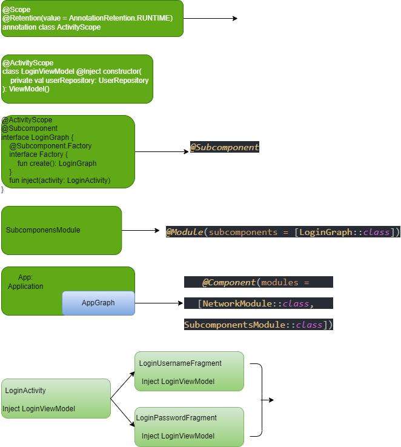

### Dagger

[about dagger](https://developer.android.com/training/dependency-injection/dagger-basics "https://developer.android.com/training/dependency-injection/dagger-basics")

#### 1. 添加使用dagger需要的依赖

1. 添加kapt插件

```gradle
plugins {
    id 'kotlin-kapt'
}

dependencies {
    //...
    //dagger
    implementation 'com.google.dagger:dagger:2.44'
    kapt 'com.google.dagger:dagger-compiler:2.44'
}
```

简单使用流程，这里只记录怎么使用，至于为什么，以后再研究。

#### 2. 在自定义的Application中修改

```kotlin
@Singleton
@Component(modules = [NetworkModule::class])
interface AppGraph {
    fun inject(activity: LoginActivity)
    fun inject(activity: MainActivity)
}

class App: Application() {
    val appGraph = DaggerAppGraph.create()
}
```

App中定义一个接口，因为这个接口使用了@Component注解，所以接口名称可以叫AppComponent，或者因为这相当于一个导航图，也可以叫AppGraph。

在这个接口里，我们定义两个方法，这两个方法，会在对应的activity中调用。@Singleton注解我们，表示单例，至于为啥在这里加，后边再说。

#### 3. 在activity中使用

```kotlin
class MainActivity : BaseActivity() {

    private val viewModel by viewModels<MainViewModel>()

    @Inject lateinit var loginViewModel: LoginViewModel

    @Inject lateinit var userLocalDataSource: UserLocalDataSource
    @Inject lateinit var userRemoteDataSource: UserRemoteDataSource

    override fun onCreate(savedInstanceState: Bundle?) {
	//需要添加到super.onCreate(savedInstanceState)之前，避免出现 fragment 恢复问题
	// Make Dagger instantiate @Inject fields in LoginActivity
        (applicationContext as App).appGraph.inject(this)
	// Now loginViewModel is available

        super.onCreate(savedInstanceState)


        Log.i("MainActivity", "userLocalDataSource: $userLocalDataSource ")
        Log.i("MainActivity", "userRemoteDataSource: $userRemoteDataSource ")

	loginViewModel.start()
    }
}
```

```kotlin
class LoginActivity : BaseActivity() {
    private lateinit var binding: ActivityLoginBinding

    @Inject lateinit var loginViewModel: LoginViewModel

    @Inject lateinit var userLocalDataSource: UserLocalDataSource
    @Inject lateinit var userRemoteDataSource: UserRemoteDataSource

    @Inject lateinit var loginService: LoginService

    override fun onCreate(savedInstanceState: Bundle?) {
	//需要添加到super.onCreate(savedInstanceState)之前，避免出现 fragment 恢复问题
        (applicationContext as App).appGraph.inject(this)
        super.onCreate(savedInstanceState)

        binding = ActivityLoginBinding.inflate(layoutInflater)


    }
}
```

如上代码，可以看到loginViewModel，userLocalDataSource，userRemoteDataSource几个都是通过@Inject注解，注入进来的。

如果你要在activity中使用，请在onCreate时候使用代码(applicationContext as App).appGraph.inject(this)，Make Dagger instantiate @Inject fields in LoginActivity，官方说明中，解释了，这句代码是通知dagger初始化，当前类中带有@Inject注解的字段，这句代码以后，当前类中带有@Inject注解的字段，就已经被实例化了，可以正常使用。另外，在fragment中使用时，请在onAttach方法中使用。

另外，这句代码需要添加到super.onCreate方法之前，官方的说法是，

> 使用 activity 时，应在调用 `super.onCreate()` 之前在 activity 的 `onCreate()` 方法中注入 Dagger，以避免出现 fragment 恢复问题。在 `super.onCreate()` 中的恢复阶段，activity 会附加可能需要访问 activity 绑定的 fragment。
>
> 使用 Fragment 时，应在 Fragment 的 `onAttach()` 方法中注入 Dagger。在这种情况下，此操作可以在调用 `super.onAttach()` 之前或之后完成。

```kotlin
class LoginViewModel @Inject constructor(
    private val userRepository: UserRepository
): ViewModel() {
    companion object {
        const val TAG = "LoginViewModel"
    }
    fun start() {
        Log.i(TAG, "start: $this")
        Log.i(TAG, "start: userRepository $userRepository")
        userRepository.start()
    }
}
```

```kotlin
class UserRepository @Inject constructor(
    private val userLocalDataSource: UserLocalDataSource,
    private val userRemoteDataSource: UserRemoteDataSource
) {
    private val TAG = "UserRepository"
    fun start() {
        Log.i(TAG, "start: userLocalDataSource $userLocalDataSource")
        Log.i(TAG, "start: userRemoteDataSource $userRemoteDataSource")
    }
}
```

```kotlin
class UserLocalDataSource @Inject constructor() {
}
```

```kotlin
class UserRemoteDataSource @Inject constructor(
	private val loginService: LoginService
) {
}
```

从以上LoginViewModel, UserRepository, UserLocalDataSource, UserRemoteDataSource几个类可以看到，如果要在其他类中使用注解，需要对这个类的构造函数增加一个@Inject注解。

同时，我在UserRepository类上，增加了@Singleton注解，表示这个在使用的时候为单例，这也是为什么之前要在App中的AppGraph接口增加@Singleton注解的原因，否则编译会报错，至于错误原因，以后再深究。

```kotlin
@Module
class NetworkModule {

    @Singleton
    @Provides
    fun provideLoginService(): LoginService {

        return Retrofit.Builder()
            .baseUrl("http://xxx-url.com")
            .build()
            .create(LoginService::class.java)
    }
}
```

在UserRemoteDataSource中使用了loginService，针对LoginService的注入，略有不同，通过@Module来实现，同时需要在App类中将@Component修改为@Component(modules = [NetworkModule::class])，另外在NetworkModule中的provideLoginService方法增加@Provides注解，如果需要这个loginService为单例，则在provideLoginService方法上加@Singleton注解，注意，这里不能将@Singleton注解加到NetworkModule类上，否则会报错。

#### 4. Dagger 子组件

上述实例中，我简单实现了dagger的用法，但是会存在一些问题，比如现在有一个LoginActivity, 两个fragment, 分别是LoginUsernameFragment, LoginPasswordFragment, 在上述类中，LoginActivity, LoginUsernameFragment, LoginPasswordFragment都需要用到loginViewModel，此时，我希望是3个类可以共用一个LoginViewModel，这样数据就可以共享，最简单的方式，你可以为LoginViewModel增加@Singleton注解，这样就可以实现功能了。

但是，这种情况下，你的LoginViewModel的生命周期是跟着application的，就算你完成了Login流程，你的LoginViewModel还是在，比如，你退出登录，然后重新登录，你拿到的LoginViewModel，依然是之前的LoginViewModel，显然这样，并不合理，这里我们需要用到Dagger子组件，可以解决这个问题。

Dagger子组件（Subcomponent）用法如下，

##### * 创建一个annotation

ActivityScope，用来表示作用域，这样就可以让LoginView在，activity和多个Fragment中保持唯一，代码如下。

```kotlin
@Scope
@Retention(value = AnnotationRetention.RUNTIME)
annotation class ActivityScope
```

##### * 创建一个Subcomponent

新建LoginGraph，用@Subcomponent注解，表示dagger的子组件，同时用之前我们定义的ActivityScope来注解，表示他的作用域，代码如下，也可以参考下图。

```kotlin
@ActivityScope
@Subcomponent
interface LoginGraph {

    @Subcomponent.Factory
    interface Factory {
        fun create(): LoginGraph
    }

    fun inject(activity: LoginActivity)
}
```

3. 创建一个SubcomponentsModule

新建一个SubcomponentsModule，使用@Module注解，并将loginGraph添加到此module中，代码如下

```kotlin
@Module(subcomponents = [LoginGraph::class])
class SubcomponentsModule {
}
```

4. 将SubcomponentsModule添加到application的Component中

将SubcomponentsModule添加到application的Component中，同时在AppGraph中去掉原来的inject方法，添加新的loginGraph方法，代码如下，

```kotlin
@Singleton
@Component(modules = [NetworkModule::class, SubcomponentsModule::class])
interface AppGraph {
    fun inject(activity: MainActivity)
    fun loginGraph(): LoginGraph.Factory
}
```

在loginActivity的onCreate方法中，实例化你的loginGraph，如下代码，

```kotlin
    @Inject lateinit var loginViewModel: LoginViewModel
    lateinit var loginGraph: LoginGraph
    override fun onCreate(savedInstanceState: Bundle?) {
  
        loginGraph = (applicationContext as App).appGraph.loginGraph().create()
        loginGraph.inject(this)

        super.onCreate(savedInstanceState)
        binding = ActivityLoginBinding.inflate(layoutInflater).also {
            setContentView(it.root)
        }
}
```

fragment中，loginViewModel注入方法如下代码，注意在fragment中，通知dagger初始化的代码，应该在onAttach方法中执行，

```kotlin
@Inject lateinit var loginViewModel: LoginViewModel
override fun onAttach(context: Context) {
        super.onAttach(context)
        (activity as LoginActivity).loginGraph.inject(this)
        Log.i("LoginUsernameFragment", "onAttach: loginViewModel $loginViewModel")
    }
```

通过这种子组件，并使用ActivityScope作用域来实现注入loginViewModel的方式，你可以发现，每次你启动activity时，在activity及两个fragment中，生成的loginViewModel都是同一个对象，就实现了loginViewModel的公用。同时，你如果再次启动loginActivity，loginViewModel将变成一个新的实例。


大致流程图示。




至此，我们已经可以正常使用dagger注解，关于如何对dagger进行封装使用，以后再研究。
